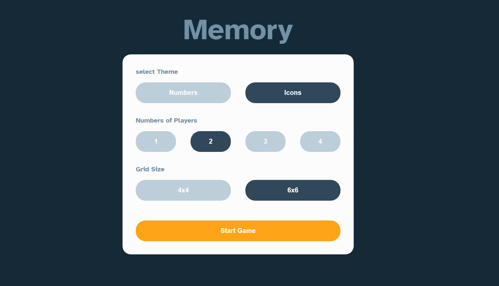
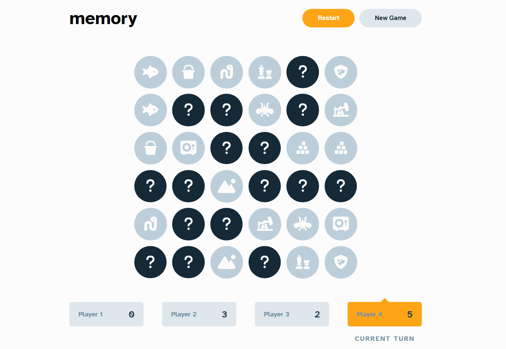
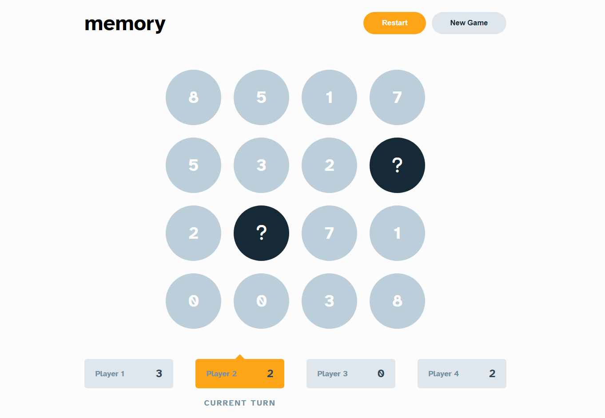
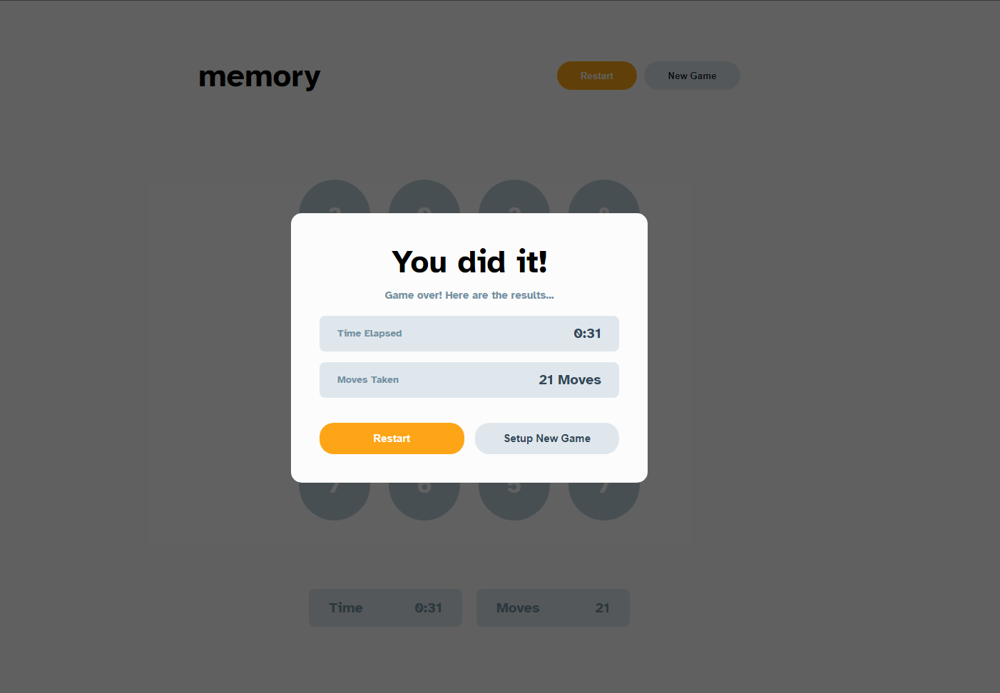
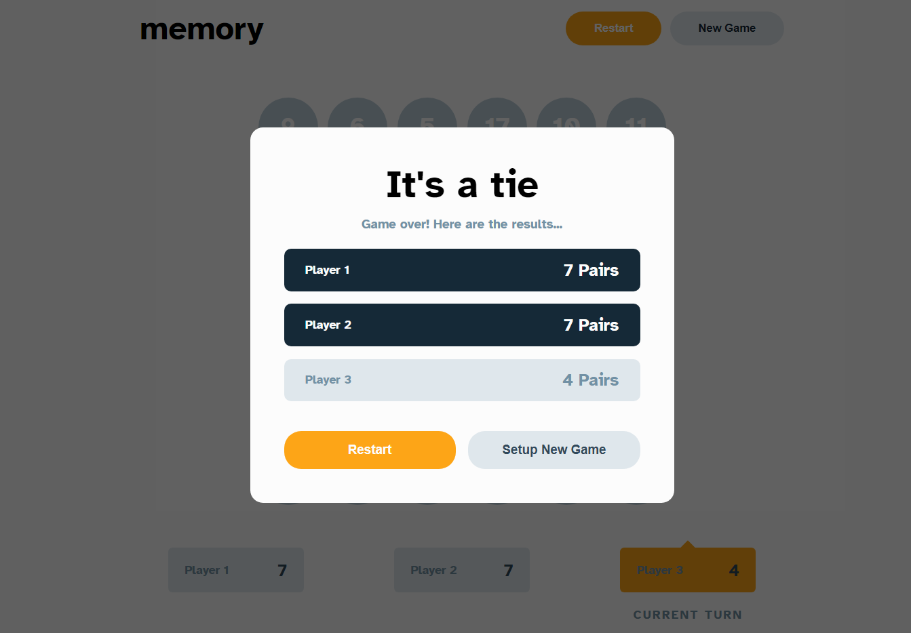
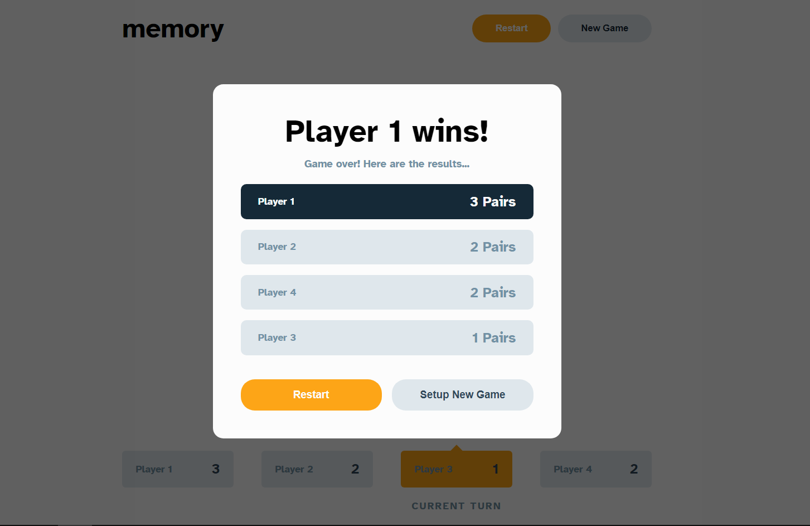

# Multiplayer Memory Game 🎮

## Hi! 👋

[Design from](https://www.frontendmentor.io)

## [Live here](https://f4enn.github.io/Advance-Multiplayer-Game/)

## The Game

### Users should be able to:

- View the optimal layout for the game depending on their device's screen size
- See hover states for all interactive elements on the page
- Play the Memory game either solo or multiplayer (up to 4 players)
- Set the theme to use numbers or icons within the tiles
- Choose to play on either a 6x6 or 4x4 grid

### Expected behaviour

- In a solo game, track the time elapsed since first clicking on a start button and the total number of moves made. A move counts as two tiles being selected as a potential match. Once all pairs have been found, stop the timer and show the end of game modal with the stats.
- In a multiplayer game, track the total number of pairs each player has found. If a player finds a pair, increment their score by one. The current turn switches to the next player after the current player has made a move to find a potential match.
- Clicking "Restart" will restart the game with the current settings
- Clicking "New Game" will go to the Start Game screen where the player can choose their settings

  ## Tech Stack 🛠️
- Semantic HTML5 markup
- Mobile-first workflow
- Vanilla javascript
- SCSS
- [Gulp](https://gulpjs.com/) - task runner

## Code refactor?
- Yes, definetely could be a good idea. with hindsight I see that would be easier delete entire code than refactor it. For example we have a function "CheckNumberPairs" and "CheckIconPairs", They are huge and almost identical, the difference is in the name of the theme, they render depends what user selected icons or numbers theme. So to fix this I could create object which storage icon and number theme and use it in function instead create two almost the same function.
- There are probably simple mistakes like this one in the code, but I want to take the time to learn more important things for now.
## Preview
### New game 

### Grid 6x6 **(Icons)**

### Grid 4x4 **(Numbers)**

### Single  **(Summary)**

### Multiplayer draw **(Summary)**

### Multiplayer **(Summary)**

